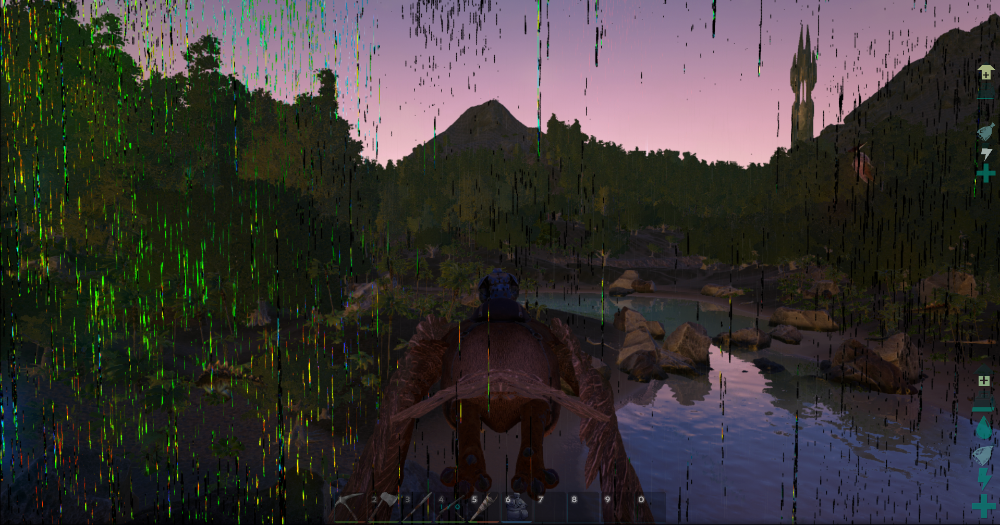
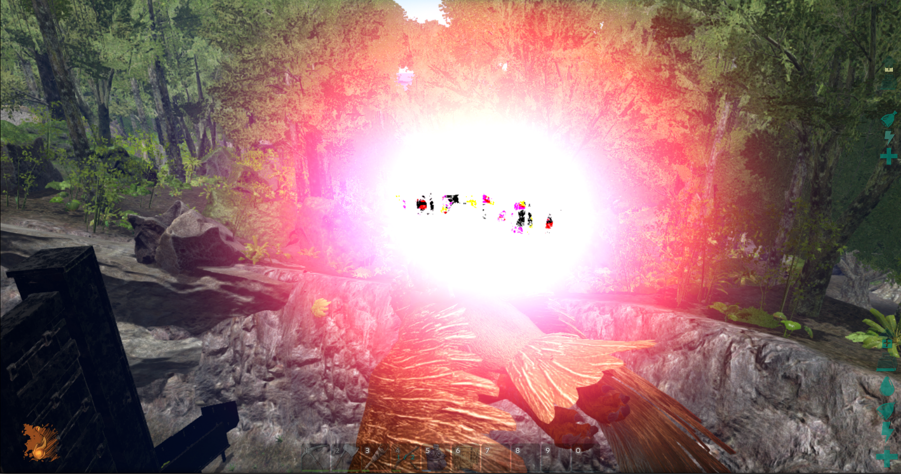

Thanks to the Steamuser Aryvandaar, he did upload the Screenshots.

Aryvandaar did say to this Bugs:

- Black textures from creature footprints, rain, "sunbeams" and trees.
- Green textures spreading in lines from plants and trees.
- Crazy FPS drops since last few patches.
- Disabling bloom makes it come back after a few minutes.
- Falling trees "blank textures" (plain colour, tan or green missing textures).
- Problem with not being able to write unicode or your own kb layout with qwerty kb (can't write question mark, special signs in wrong places, not able to write some).
- Screenshot with "blank" green textures on plants (high texture settings). Seems to be a loading issue. 

My mind:

That graphic issues comes often after some houres of play or if you change the graphic settings, without a restart.
If some of that issues are active, a restart helps to fix that.

